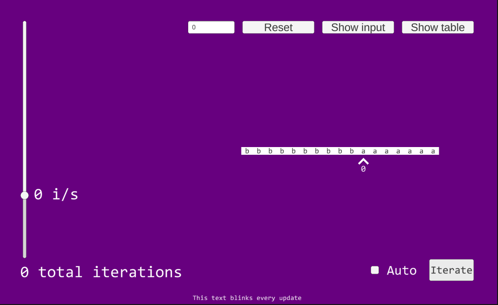
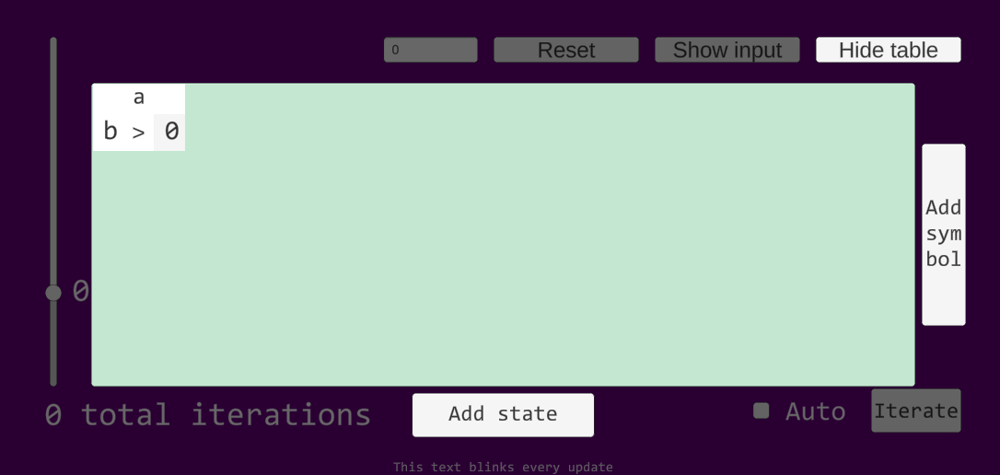
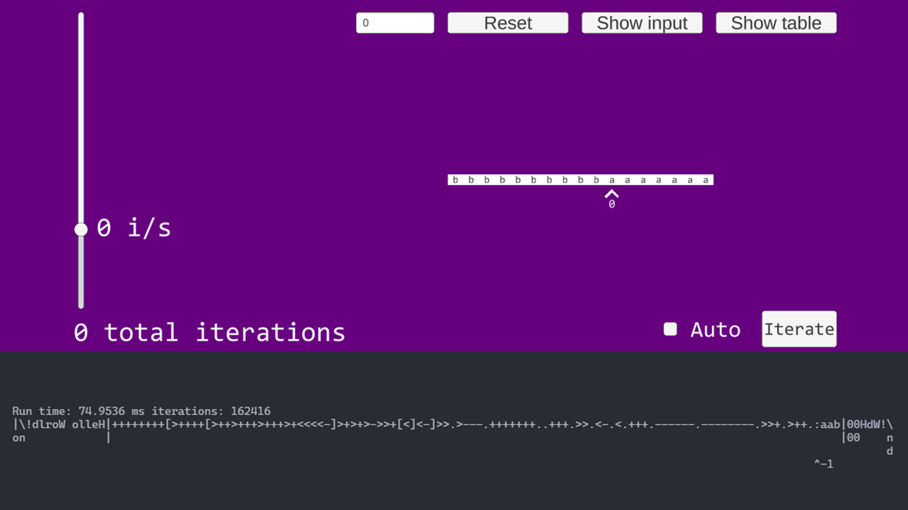

# Turing machine emulator

A turing machine emulator written in C++ with Unity as UI. Edit state table and simulate is's work in automatic or manual mode. This project also contains Turing machine [interpreter](./cpp/brainfuck.h) for the Brainfuck language using 26\*25 base table extended with 256 rows and columns. You can learn more about turing machines [here](https://en.wikipedia.org/wiki/Turing_machine). 

To run turing machine emulator just open Unity project and run it (maybe need to compile dll). To recompile C++ files into `.dll` you can use g++ and this flags:

```shell
$ g++ -m64 -fpic -Wall -shared turing.cc -o turing.dll
```

To run brainfuck interpreter you need to compile and run [this](./cpp/run_brainfuck.cpp) `.cpp` file

## Examples

Demo



Table that converts all `a` to `b`



Combo



